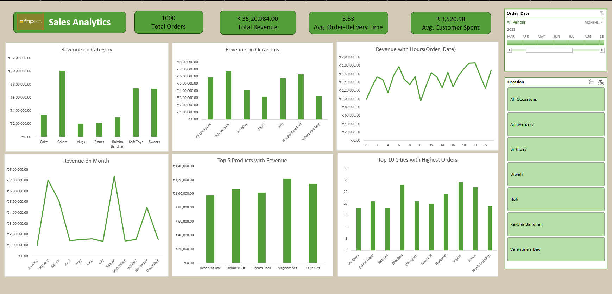

Ferns & Petals Sales Analytics Dashboard

Project Overview
This project is an interactive Sales Analytics Dashboard developed in Microsoft Excel to analyze the sales performance of Ferns & Petals (FNP), a gifting company that delivers products for various occasions such as Diwali, Valentine’s Day, Birthdays, and Anniversaries.
The objective of this project was to transform raw transactional data into meaningful insights that support data-driven business decisions. The dashboard provides a clear view of revenue performance, customer behavior, product trends, and geographical demand using structured visual analysis.

Business Objective
•	Monitor overall revenue and order performance
•	Identify top-performing products and categories
•	Analyze monthly and seasonal sales trends
•	Compare revenue across different occasions
•	Evaluate customer spending patterns
•	Study delivery efficiency
•	Identify high-demand cities
This dashboard was designed to answer these business questions through structured KPI tracking and visual analysis.

Key Performance Indicators
•	Total Orders 
•	Total Revenue
•	Average Order Delivery Time
•	Average Customer SpendingThese KPIs provide a quick overview of overall business scale, operational efficiency, and customer value.

Analytical Insights Covered

1.	Category-wise Revenue Analysis
Comparison of revenue across product categories such as Cakes, Colors, Mugs, Plants, Soft Toys, Sweets, and Raksha Bandhan products.
2.	Occasion-based Revenue Comparison
Revenue distribution across occasions including Anniversary, Birthday, Diwali, Holi, Raksha Bandhan, and Valentine’s Day.
3.	Monthly Sales Trend
Analysis of revenue fluctuations across different months to identify seasonal demand patterns.
4.	Hourly Revenue Analysis
Identification of peak revenue-generating hours to support operational planning.
5.	Top 5 Products by Revenue
Identification of highest revenue-generating products.
6.	Top 10 Cities by Orders
Analysis of cities contributing the highest order volumes to support regional strategy planning.
The dashboard includes dynamic filtering by Order Date and Occasion for interactive exploration.

Tools and Techniques Used
•	Microsoft Excel
•	Pivot Tables
•	Pivot Charts
•	Slicers for dynamic filtering
•	KPI cards
•	Data cleaning and data transformation
•	Time-based trend analysis

Files Included in the Repository
Dashboard Workbook
•	ferns-n-petals.xlsx
Final interactive Excel dashboard containing all visualizations and KPI analysis.
Datasets Used
•	customers.csv – Customer details
•	orders.csv – Order transactions and delivery information
•	products.csv – Product information and categories
These CSV datasets were cleaned, structured, and combined to build the final analytical dashboard.
Documentation
•	Executive_Summary.pdf
•	Problem_Statement.pdf
These documents explain the business problem and analytical approach in detail.

Dashboard Preview

Learning Outcomes
Through this project, I gained practical experience in:
•	Transforming raw sales data into structured business insights
•	Designing KPI-driven dashboards
•	Performing time-series and occasion-based sales analysis
•	Analyzing customer spending patterns
•	Presenting analytical findings in a clear and business-oriented format

Author
Shushar Kulal
Aspiring Data Analyst
Skilled in Excel, Data Visualization, and Business Intelligence

